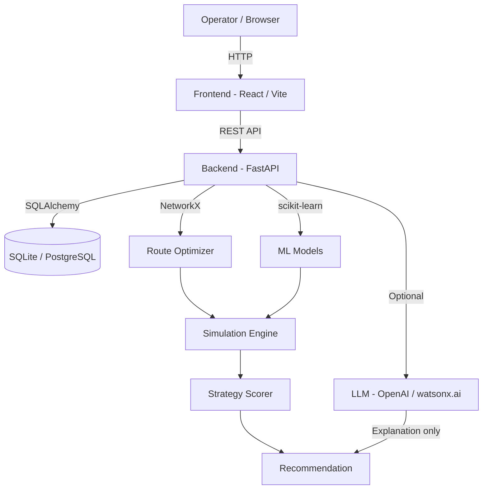

# Architecture

## System Architecture

ChainMind AI follows a full-stack architecture with a clear separation between the deterministic simulation core and the LLM-based explanation layer.



## Components

| Component | Technology | Responsibility |
|---|---|---|
| Frontend Dashboard | React 19, Vite 8, Tailwind | Crisis simulation UI, charts, maps, what-if comparison |
| Backend API | FastAPI, Uvicorn | REST endpoints, request validation, orchestration |
| Database | SQLAlchemy + SQLite/PostgreSQL | Digital twin state: ports, routes, shipments, fleet |
| Simulation Engine | Python (custom) | Cascading impact calculation, delay estimation |
| Route Optimizer | NetworkX (Dijkstra) | Graph-based alternative route discovery |
| Fleet Optimizer | Python (custom) | Proximity-based fleet availability matching |
| Risk Scorer | Python (documented formula) | Per-shipment risk scoring (6-factor weighted model) |
| ML Models | scikit-learn RF + GB | Delay prediction, risk classification augmentation |
| LLM Explainer | OpenAI / watsonx.ai / template | Human-readable strategy explanation |

## Data Flow

1. **Operator submits scenario** via React dashboard (`POST /api/simulate`)
2. **FastAPI validates** the request (Pydantic schema)
3. **Simulation engine** loads digital twin state from SQLite
4. **Disruption applied**: affected routes/ports removed from NetworkX graph
5. **Directly affected shipments** identified via route/port FK relationships
6. **Cascading impact** calculated for indirectly affected shipments
7. **Per-shipment risk scored**: `w_delay*delay + w_value*cargo_value + w_coldchain*cc_risk + w_route*route_risk + w_priority*priority + w_fleet*fleet_penalty`
8. **Alternative routes found** via Dijkstra shortest-path on disruption-pruned graph
9. **Fleet assets ranked** by proximity and refrigeration capability
10. **Three strategies generated** (Cheapest/Fastest/Balanced) with computed costs/delays
11. **Decision engine scores strategies** using multi-factor matrix (cost 25% + delay 30% + cold-chain 25% + risk 20%)
12. **LLM generates explanation** (or template fallback) — does NOT affect the recommendation
13. **Response returned** to frontend as structured JSON
14. **Frontend renders** impact summary, charts, strategy cards, explainability panel

## Risk Scoring Formula

```
risk_score = 0.25 * norm_delay
           + 0.20 * norm_cargo_value
           + 0.20 * cold_chain_risk
           + 0.15 * route_risk_score
           + 0.15 * priority_score (inverted: P1=1.0, P4=0.25)
           + 0.05 * fleet_availability_penalty

Output levels:
  [0.0, 0.3)  → Low
  [0.3, 0.5)  → Medium
  [0.5, 0.7)  → High
  [0.7, 1.0]  → Critical
```

## Security Considerations

- All secrets stored in environment variables (never committed)
- CORS configured to allow only specified origins
- Input validation via Pydantic schemas on all endpoints
- No arbitrary code execution paths
- SQLite DB excluded from git via `.gitignore`
- ML model artifacts excluded from git (regenerated locally)

## Scalability Notes

- FastAPI backend is stateless and can be horizontally scaled behind a load balancer
- SQLite → PostgreSQL migration requires only changing `DATABASE_URL`
- Simulation runs are stored in the DB, enabling async result retrieval
- LLM calls are optional and isolated — removing them does not affect core simulation
- NetworkX graph is rebuilt per simulation (stateless); for production, could be cached and invalidated on data changes
- Frontend can be deployed to any static CDN (Vercel, Netlify, Cloudflare Pages)
